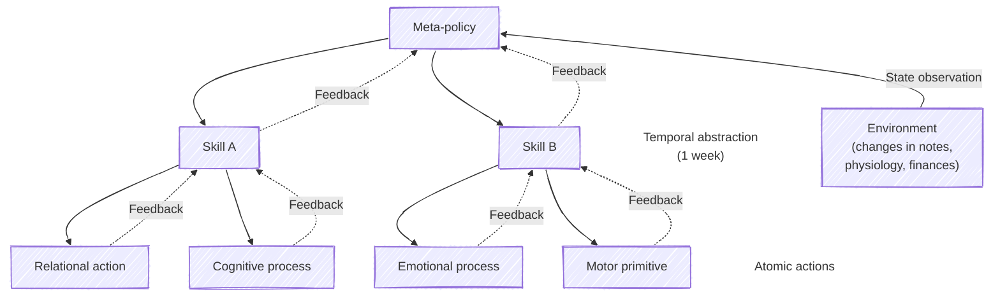

<!-- The whole letter for the week of 18 September 2026, shown but not
     published: no src, so only its waveform is drawn, from peaks made by
     `npm run audio:peaks -- <the mp3> public/files/lifelogging/lifelog-2026-09-18.peaks.json`. -->
<audio class="snippet" data-peaks="/files/lifelogging/lifelog-2026-09-18.peaks.json" data-label="The full letter for 18 September 2026"></audio>

AI has...

> [!cite]
> Zak, P. J. (2015). [Why inspiring stories make us react: The neuroscience of narrative](https://www.ncbi.nlm.nih.gov/pmc/articles/PMC4445577/). In *Cerebrum: the Dana forum on brain science*.

<!-- One line per clip; src/components/AudioTickerRuntime.astro builds the
     player around it. Cut and exported by `npm run audio:trim`. -->
<audio class="snippet" src="/files/lifelogging/test-a-full-chain-opel-32x-reverb12.mp3" controls preload="none"></audio>

# Hunks track changes

Everything below is built out of one unit, so it is worth a minute on its own. `journal.md` is a single note of about 2,500 words. Microlite takes a snapshot of every note on a timer, and a **hunk** is the difference between two consecutive snapshots: a run of lines that changed, with a few unchanged lines either side for context. A week of journalling is a handful of hunks; a note nobody opened that week has none.

Edit the note below and watch what comes out of it. The last square is the hunk being written — dark until the note differs from the snapshot under it, then coloured by what the edit has done so far. Take a snapshot to close that hunk and open the next one, and the square freezes at whatever it had become. Keep going and you get a row of them, which is the whole of the chart further down: click any square to read the hunk it stands for.

<figure>
<iframe class="wide" title="An editable 2,500-word note beside the hunk that editing it produces, with one square per snapshot taken, coloured by whether that edit added lines, removed them, or both" src="/files/lifelogging/what-is-a-hunk.html" height="680" loading="lazy"></iframe>
</figure>

# Weekly snapshots
Snapshots taken roughly a week apart of Hamlet's journal; Claude generated journals from Hamlet's perspective, roughly corresponding to acts I through IV of the play, as if it had taken place in present day.

<figure>
<iframe class="wide" title="Waffle chart of four weeks of edits to a synthetic journal, one square per edit" src="/files/lifelogging/microlite-waffle.html" height="900" loading="lazy"></iframe>
</figure>

# Patterns across snapshots
A language model read the fourth week and wrote a letter back. Each arrow is one sentence of that letter, joining the two edits it was written from. Click an arrow.

<!-- `data-src`, not `src`: this chart brings duckdb-wasm and Mosaic with it —
     7.4 MB over 60 requests to a CDN — and it is a long way down the page.
     loading="lazy" is not enough on its own to keep that off the initial load;
     see src/components/DeferredFrames.astro. -->
<figure>
<iframe class="wide" title="Waffle chart of the same edits coloured by topic, with arrows for the connections the letter drew between them" data-src="/files/lifelogging/connections-topics.html" height="1100"></iframe>
<noscript>
<a href="/files/lifelogging/connections-topics.html">Open this chart on its own page</a> — the frame above waits for you to scroll to it, which needs JavaScript.
</noscript>
</figure>

# Do it yourself

The easiest way I've found to do this is to use [Obsidian](https://obsidian.md/) to take personal and work notes. By looking at successive differences in the 'file recovery' feature built into Obsidian, it is possible to create snapshots of how every note has changed over a given time period. 

With the help of Claude I created the [Microlite Obsidian plugin](https://community.obsidian.md/plugins/microlite) to enable creating these snapshots automatically. 

For pulling physiology and sleep data, I use the Oura ring with the [Oura Metrics plugin](https://community.obsidian.md/plugins/oura-metrics) for Obsidian.

To connect my bank accounts, investments, and credit card I used the [plaid-sync](https://github.com/mbafford/plaid-sync/) tool that leverages the [Plaid API](https://plaid.com/) to extract data from financial institutions into a [plain text format](https://sgoel.dev/posts/10-years-of-personal-finances-in-plain-text-files/) called Beancount.

To orchestrate all of this, with Claude and my friend David's input, we built [Petrograph](https://github.com/altosaar/petrograph). This takes the above sources as input (Microlite for snapshots of changes in notes, plain text finances data, and physiology data from Oura), and prompts Claude with something like the following:

> As an expert in Acceptance and Commitment Therapy and psychometric profiling from a clinical-psychology lens, provide stances to practice for the upcoming week. Keep it irreverent where appropriate, and circumscribe what to hold loosely, how to approach what is on my mind, and logistics or operations in the upcoming days such as summarizing any open loops. I'm open to any psychoemotional reads, metaphors or challenges you may have as an expert in these areas.

Then the [Eleven Labs](https://elevenlabs.io/) voice AI is used to convert the text to speech, and some audio plugins are used to add some effects like reverb and compression and mix it with a background audio track of the user's choice. This is the final output you can hear snippets of above.

Wary about sharing all of this personal data with Anthropic or OpenAI or using closed-source APIs like Eleven Labs'? I am too! Thankfully, when my friend David's partner was interested in trying this system out but didn't want to share their data, he whipped up a completely open source toolkit that spins up Amazon Web Services instances that ensure no private data ever gets shared with external services. You can find that here: https://github.com/dlakata/sublimation (we have tested its integration with the above tools, and no I haven't heard of anything more romantic in terms of infrastructure as a love language).

# Guardrails

# Summary

In the middle of several weeks, I have at times feared Claude's future admonishment, fretting about what it would chide me about next - whether my actions were aligning with my stated values, whether I did what I said I wanted to. I worried whether I was becoming an agent taking atomic actions in a hierarchical world model of Claude's construction using a fun-house mirror of my journals, with me sitting in Plato's cave.

Despite ingesting all this slop, my life has not been significantly altered. It still entertaining, and a vehicle for sharing different sides of myself with those I'm close to in a weird new way.

But it has brought into relief ever smaller moments that cannot and will not be replaced by AI, such as catching someone off guard with the inverse goggles gesture. This is a great way to prove you are still human.

<figure class="half">

<figcaption>© 1972 Mick Rock.</figcaption>
</figure>

Do you know of even quirkier ways of using AI for hyper-personalized self reflection? Please email me! I started doing machine learning 12 years ago and feel like I'm barely scratching the surface - I'm excited to see what use cases generation alpha cooks up.

## Acknowledgments

Thank you to Toby for referencing this practice as [lifelogging](https://en.wikipedia.org/wiki/Lifelog); to David, Sophie, Elana for thought partnership; to Frankie for calling this "Claudio journaling", and to additional friends who tolerated my sending of AI slop and cursed visualizations over the course of these experiments. 

# References
> [!cite]+
> The [Story-Telling Animal: How Stories Make us Human](https://www.amazon.com/Storytelling-Animal-Stories-Make-Human/dp/B08XLJ8XC9) is a book about our make-believe nature, traversing storytelling's evolution as a fundamental human instinct
> 
> [Pixar's \[Abridged\] Rules for storytelling](https://www.aerogrammestudio.com/2013/03/07/pixars-22-rules-of-storytelling/)
> 
> A library on all-things empathy, which may inspire you to practice it in different ways: [https://empathylibrary.com/](https://empathylibrary.com/)
> 
> [Empathy: Why It Matters and How to Get it](https://www.amazon.com/Empathy-Why-Matters-How-Get/dp/0399171401) is a book covering the science of empathy and arguing for empathy for a happier, more creative society. [🏴‍☠️ PDF](https://libgen.li/index.php?req=Empathy%3A+Why+It+Matters+and+How+to+Get+it)
>
> https://jordancooper.blog/2024/10/11/lifelogging-in-the-age-of-ai/
