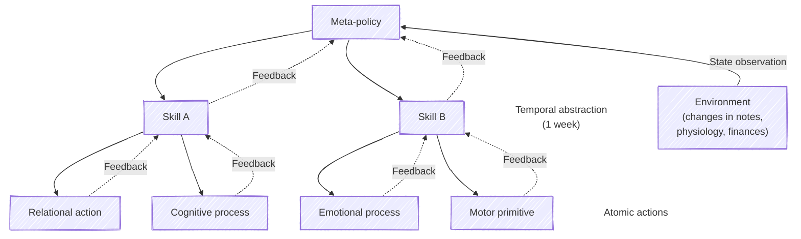

> Each week I give an AI my journal, notes, sleep, and financial data and receive a 15-minute podcast. It's right often enough to move me, and wrong enough to keep me vigilant.

The first time AI makes me tear up I'm biking down a sunny Brooklyn street. 

"Grief is not a prodrome," the synthetic voice says. The authoritative phrase lands. I become aware of a permission to feel, with a bit more ease, the pain of a recent breakup—absent the worry that my tears might be an early warning sign, or prodrome, of depression.[^depression]

This is a connection drawn by a large language model after being fed my journal, where I worried about whether I was depressed or experiencing normal, healthy sadness.

I didn’t plan for this lacrimal event, as I hadn't prompted the AI for advice related to the breakup. But it had the necessary context to generate this personalized truism: access to hundreds of note edits I’d made in the past week, ranging from journals, to-do lists, doctor notes, to project and grocery lists, in addition to financial and sleep data. An early personal operating system. The prompt was designed to provide a psychoemotional summary of my experiences alongside stances for the upcoming week. 

I felt relief at this labeling of affect, the release of some cognitive and emotional load I wasn’t fully aware of.[^load]

Then I felt repulsed. Thrown into the uncanny valley of insecurity. How should I relate to getting emotional at insights created by artificial intelligence? 

I still don’t know, so I’m writing.

## Background 

Friends and I have been lifelogging with large language models for the past half a year, and the practice has changed how I make sense of myself each week. As we design increasingly coupled systems between humans and AI, we will undergo many more shifts in cognitive and relational processes.[^rct]

Affordances shape our cognition: we count in tens because we carry ten fingers, and those with internet access and a smartphone carry AI that is nearly always available to mediate between the seeker and the sought. In a decade, perhaps parts of our cognition will rely on AI as we do our fingers or other tools that permeate our environment. I can't fathom if this is terrifying or transcendent, so I'm working toward and hoping for the latter.

The cognitive prostheses we design---lifelogging being but a small example---make me hopeful for positive futures where we live well, aided by  algorithms. I've also found that in pushing AI journaling and other use cases to their limits, I'm confronted with the human aspects of life that are not legible to machines. These outliers, failures, and edge cases are often the most interesting and meaningful.

This article describes how lifelogging with AI works, how you can try it, and ways to mitigate associated risks.

# Lifelogging

As a nautical logbook is used to chart the daily progress of a ship, so the logging of life can mean journaling or collecting other types of data on daily experiences to make sense of where we're headed.

In addition to manual curation and input, there are many automated interfaces for aggregating data around sleep, finances, and online activities. 

This is all excellent _context_ for large language models, which can help identify idiographic patterns, specific to our individual experiences. 

A lifelog is information-dense and can contain many descriptions of emotionally salient events, so I find it hard to absorb by reading. Rather, I prefer listening to it. I receive a 15- to 20-minute audio, a personalized podcast that gets automatically created each week based on the inputs fed to the AI. 

Here's what a typical AI lifelog looks like, alongside annotations to show what topics came up that week:

<!-- The whole letter for the week of 18 September 2026, shown but not
     published: no src, so only its waveform is drawn, from peaks made by
     `npm run audio:peaks -- <the mp3> public/files/lifelogging/lifelog-2026-09-18.peaks.json`. -->
<audio class="snippet" data-peaks="/files/lifelogging/lifelog-2026-09-18.peaks.json" data-label="The full letter for 18 September 2026"></audio>

These highlights include prioritizing relationships, dealing with a reorg at work, planning for the weekend and week ahead, contemplating family dynamics, and reviewing exercise, finances, and sleep data. 

Were I to manually review these streams of data, it would take me much longer than this lifelog summary. That's part of why I've found this practice worthwhile. On the other hand, the AI has surfaced many satisfying parallels between disparate experiences and references.

Below are examples of these links. I also added failures like the hallucinations that occur in around 10% of the sentences generated and keep me vigilant when listening:

- <audio class="snippet snippet--inline" src="/files/lifelogging/heart-rate-variability-connection-to-stressful-event.mp3" data-label="a 39-second clip of the letter tying a dip in my heart rate variability to a stressful afternoon" controls preload="none"></audio> Linking a stressful event---a friend and I helping someone in need in Spanish---to my physiology data and stress measurements that showed my body responding and recovering.
- <audio class="snippet snippet--inline" src="/files/lifelogging/trash-club-commitment-redundancy-admonishment.mp3" data-label="a 23-second clip of the letter admonishing me twice over one commitment to a trash-pickup club" controls preload="none"></audio> Admonishing me for doing too much volunteer work for a [trash club](https://plgcleanup.org) I had intended to spend less time on.
- <audio class="snippet snippet--inline" src="/files/lifelogging/sleep-activity-read-insomnia.mp3" data-label="a 1 minute 29 second clip of the letter reading a week of sleep against a week of activity, and what it made of my insomnia" controls preload="none"></audio> Summarizing sleep and physiology data for the week.
- <audio class="snippet snippet--inline" src="/files/lifelogging/couch-return-eyebrow-apology.mp3" data-label="a 21-second clip of the letter failing to notice I had returned a couch" controls preload="none"></audio> Reporting a refund for a couch. (I had to infer this was the refund coming through; the model confabulated the refund as me "selling" the couch for exactly the same amount I paid for it.)
- <audio class="snippet snippet--inline" src="/files/lifelogging/father-surgery-confabulation.mp3" data-label="a 57-second clip of the letter inventing a detail about my father's surgery" controls preload="none"></audio> The most egregious hallucination; my dad was not recovering from surgery and was not in Estonia.
- <audio class="snippet snippet--inline" src="/files/lifelogging/overproduced-voice-memo-chiding.mp3" data-label="a 27-second clip of the letter chiding me about an overproduced voice memo" controls preload="none"></audio> Chiding me about getting back into music production by way of overproducing a voice memo for my little brother, which is rich to hear from a synthetic voice. 
- <audio class="snippet snippet--inline" src="/files/lifelogging/most-2026-sentence-ever-written-fake-self-awareness.mp3" data-label="a 16-second clip of the letter performing self-awareness about performing self-awareness" controls preload="none"></audio> The model's performative self-awareness about being a simulated voice, describing its words as the "most 2026 sentence ever written."

The next sections describe how these connections between notes, physiology, sleep, and finances are made possible using AI. 

# Hunks track note edits

To help large language models track changes in text over time, it is helpful to borrow a term from programming, as AI works well with text that looks like code.

_Hunks_ help large language models hone in on patterns in edits, rather than across the entirety of notes. This is a workaround to the limitation of all such models, which have a finite context window in which they are able to locate patterns. The AI's context window can get overloaded if it is fed dozens of notes that are each hundreds of thousands of words in length (say, yearly journals, books, or long projects) and it is then asked to generate a response to a prompt. When this happens, there is an increased risk of hallucinations or poor performance in making inferences. Informally, this is known as context rot, and the use of hunks rather than the full text of notes helps mitigate this issue.

A hunk represents the changes made to a piece of text, alongside surrounding context. In this example, the symbols at the top tell the computer the location a change was made, the minus symbol indicates a line was removed, and the plus denotes that this line had an addition:

<!-- The smallest hunk there is: one line changed, one line of context either
     side, and the header saying where in the note it sits. One <code> per
     line, classed as the hunk boxes in the two charts below class theirs;
     styled in src/components/Prose.astro. -->
<figure class="hunk">
<code class="ln-h">@@ -1,3 +1,3 @@</code>
<code class="ln-c"> slept OK.</code>
<code class="ln-d">-returned the couch</code>
<code class="ln-a">+returned the couch - refunded.</code>
<code class="ln-c"> Trash pickup Sunday.</code>
</figure>

To grok a hunk, it's easiest to create one yourself to understand how it represents and tracks changes as you edit. You can click the snapshot button to freeze your edits, and then click through the history corresponding to different versions of the note and the sets of changes you made.

<figure>
<iframe class="wide" title="An editable 2,500-word note beside the hunk that editing it produces, with one square per snapshot taken, coloured by whether that edit added lines, removed them, or both" src="/files/lifelogging/what-is-a-hunk.html" height="680" loading="lazy"></iframe>
</figure>

# Weekly snapshots

It's possible to take a snapshot of a collection of notes, to create a set of hunks. This snapshot can then be fed to an AI model to find how the sets of note edits may be related.

To illustrate taking a snapshot of hunks, here are checkpoints made roughly a week apart of Hamlet's fake journal.[^hamlet]  Click on the squares to see the note and hunks associated with it, week over week. 

<figure>
<iframe class="wide" title="Waffle chart of four weeks of edits to a synthetic journal, one square per edit" src="/files/lifelogging/microlite-waffle.html" height="900" loading="lazy"></iframe>
</figure>

# Patterns

Given sets of snapshots of note edits across time, large language models can identify connections between them. This is where "insights" are generated that a human might not have had the capacity to make between the various digital artefacts they logged, such as a quote they saved weeks ago being relevant to a new situation. In this diagram, these links are illustrated by the arcs drawn between the hunks. Click on one to see which notes the AI marked as related in Hamlet's lifelog, and the rationale for why. In the first example, Hamlet saved a quote from a mathematician about an approach to problem solving that the model brought up as being applicable to his present situation with Ophelia.

<!-- `data-src`, not `src`: this chart brings duckdb-wasm and Mosaic with it —
     7.4 MB over 60 requests to a CDN — and it is a long way down the page.
     loading="lazy" is not enough on its own to keep that off the initial load;
     see src/components/DeferredFrames.astro. -->
<figure>
<iframe class="wide" title="Waffle chart of the same edits coloured by topic, with arrows for the connections the letter drew between them" data-src="/files/lifelogging/connections-topics.html" height="1100"></iframe>
<noscript>
<a href="/files/lifelogging/connections-topics.html">Open this chart on its own page</a> — the frame above waits for you to scroll to it, which needs JavaScript.
</noscript>
</figure>

# Do it yourself

To become a practitioner of lifelogging with large language models:

1. Use the [Obsidian](https://obsidian.md/) desktop and mobile app to take notes about your life, emotions, messages, other salient things. Do this for a week; the more source material the more interesting the result. 
2. Use the [Microlite](https://community.obsidian.md/plugins/microlite) plugin to generate a snapshot of the edits across your notes.
3. Give this snapshot to a large language model, and ask it for patterns and connections in the snapshot.
4. Continue once a week as you see fit.

**Orchestration.** With Claude and my friend David, we built [Petrograph](https://github.com/altosaar/petrograph). This toolchain gathers the above sources as input, in addition to plain text finances data [via Plaid](https://github.com/mbafford/plaid-sync/) (in [plain text format](https://sgoel.dev/posts/10-years-of-personal-finances-in-plain-text-files/)), and [physiology data from Oura](https://community.obsidian.md/plugins/oura-metrics). The large language model is fed this context and prompted with the following:

> As an expert in Acceptance and Commitment Therapy and psychometric profiling from a clinical-psychology lens, provide stances to practice for the upcoming week. Keep it irreverent where appropriate, and circumscribe what to hold loosely, how to approach what is on my mind, and logistics or operations in the upcoming days such as summarizing any open loops. I'm open to any psychoemotional reads, metaphors or challenges you may have as an expert in these areas.

Given the model output, a voice AI is used to convert the text to speech, the audio is processed with reverb and compression, and mixed with a background track of your choice. This is the final output you can hear snippets of above.

**Open source models.** Wary about sharing all of this personal data with Anthropic or OpenAI? I am too! Thankfully, when David's partner became interested in lifelogging but didn't want to share their data, he whipped up a completely open source toolkit that spins up Amazon Web Services instances to ensure no private data ever gets shared with Anthropic or OpenAI. You can find his setup at the [Sublimation repository page](https://github.com/dlakata/sublimation). Sublimation is integrated with this workflow, and no I haven't heard of anything more romantic in terms of infrastructure as a love language.

**Commercial solutions.** Several commercial solutions exist for this type of AI-assisted journaling, such as [Rosebud](https://www.rosebud.app/), [Mindsera](https://mindsera.com/), [Moodsearch](https://moodsearch.com/), [Untold](https://www.untoldapp.com/), [human-md](https://human-md.com/), and [Thyself](https://www.thyself.ai/). This can involve sharing your private data with even more entities and paying subscription fees, so there are trade-offs.

# Guardrails

1. No memory across sessions. Disable it in [Claude](https://support.claude.com/en/articles/11817273-use-claude-s-chat-search-and-memory-to-build-on-previous-context) and [ChatGPT](https://help.openai.com/en/articles/8590148-memory-in-chatgpt). This can help avoid context rot and gives you more control over what the AI has access to.
2. No followup questions. This can help avoid reassurance-seeking behavior.
3. A fresh session every 5–10 lifelogs. This also helps avoid context rot.

Beyond these guardrails, it's important to note that **lifelogging is not a replacement for therapy**.[^disintermediation] Despite using words like “therapy” in prompts, and helping me make sense of myself, there are several aspects of human-to-human therapy that are crucial to the process. For example, difficult interactions with a therapist can make patterns of behavior more apparent, and resolving them in a safe therapeutic space can make new patterns more accessible in regular life. Further, while a therapist can serve as an attachment figure, AI is an unreliable narrator that hallucinates; the resulting feelings of whiplash can lead to disorganized fear of whether to trust it or remain vigilant.

AI psychosis is somewhat publicized, and it warrants repeating: 
dealing with difficult and traumatic experiences using AI can be dangerous. Several risks of AI use are [documented](https://www.nature.com/articles/s41746-026-03054-x), such as psychosis, and several deaths by suicide. Paying attention to known risk factors such as hypergraphia or excessive use is important. Without humans to help you tether to reality, your sense of what is real can become blurred. One framework that may help detect risky interactions is "[vulnerability-amplifying interaction loops](https://www.nature.com/articles/s41591-026-04577-2)."

**Long-term risk.** As this practice can inform relational and emotional decisions and behaviors, this might seem low-risk in the short- and medium- term or per-decision, but over time taking input from large language models can alter us in ways we cannot foresee, that make such changes difficult to consent to.

# Epilogue

In the middle of several weeks, I have feared Claude's future admonishment, fretting about what it would chide me about next---whether my actions were aligning with my stated values, whether I did what I said I wanted to. I worried whether I was becoming an agent taking atomic actions in a hierarchical world model of Claude's construction using a fun-house mirror of my journals, me in Plato's cave. Recursive self improvement for mere humans may be futile.

However, when I felt ready to give up a new insight would arrive, or a friend would share something like this: 

> Sent [my partner] my whole lifelog, they loved it. Thanks for making this possible! I've sometimes wondered how to share more with them, but neither of us wants to read all the journal entries in detail, and I'd still like to keep some private.

These two have one of the closest marriages I've witnessed, so it was motivating to continue seeing how such practices could foster new social forms of intimacy. Maybe this is a vehicle for sharing different sides of ourselves with those we are close to in a weird new way. Like Tolstoy sharing his entire diary with his wife before they married, future vows may involve sharing prompt histories to signal vulnerability.

Besides having fun building this and speculating, these past many months are the most consistent I've been with weekly and monthly reviews, and that has made me feel more conscientious. I've put in a bit more effort into messages to friends and family knowing I could copy them into my notes for richer context, a small incentive for deeper connection that feeds two birds with one scone. By forcing myself to listen to a summary of what I've been balancing each week, it has also made me a touch more self-compassionate and aware of everything I _have_ accomplished versus the default of focusing on what I need to or want to do but have not yet done.

Now when I bike and the AI speaks, the load-bearing wordplay still makes me laugh, though I'm less surprised at what it makes up. I'm more familiar with my own emotional response to connections between aspects of my life I hadn't had the time to make. For a brief moment, I get to reflect on where I'm at and where I'm headed, with a bit more space. 

That's enough to continue evolving this care operation.

P.S. This article was written manually, and the visualizations were made with Claude.

P.P.S. One of the emergent joys of this practice has been noticing small moments that cannot and will not be replaced by AI, such as catching someone off guard with the inverse goggles gesture. (This is a great way to prove you remain human.)

<figure class="half">

<figcaption>© 1972 Mick Rock.</figcaption>
</figure>

> Do you know of even quirkier references on using AI, or are you also experiencing cognitive, behavioral, relational shifts? Please [email me](mailto:j@jaan.io)! After 12 years of learning and working in AI, I’m barely scratching the surface of what is becoming possible. I'm excited to see what use cases Generation Alpha is cooking.

## Acknowledgments

Thank you to Toby for describing this practice as [lifelogging](https://en.wikipedia.org/wiki/Lifelog) and to Frankie for calling it "Claudio journaling"; to David, Sophie, Elana, Maggie for thought partnership, and to several more friends who tolerated my sending of AI slop and cursed visualizations over the course of these experiments.

[^depression]: Writing this a few months later, and with the help of my psychiatrist, I can confirm it was the former; a normal situational grief response. I saw a therapist for many months after the breakup and continue to see a psychiatrist. If I’m ever experiencing acute mental health symptoms, I restart therapy and encourage everyone with access to do the same.

[^load]: Such affect labeling can be cathartic. For example, kids experience the “name it to tame it” trick of parenting: if they’re frustrated at not having eaten, but haven’t connected the dots between the emotion and their distress, simply being told “you’re frustrated right now” can becalm them.

[^rct]: We won't have randomized controlled trials every step of the way to guide us, and need to rely on anecdata and cultural transmission like this $N=1$ experience report I'm sharing here.

[^disintermediation]: Technological disintermediation---where technology like AI replaces a mediator such as a therapist, doctor, friend, or family member, who we might turn to for reassurance or an answer to a question---is worrisome. The oracular, reduced friction and privacy we might perceive in AI, combined with the incentives of model providers, creates a dynamic of inserting large language models into every possible process and leads to new failures. As Paul Virilio says, the invention of the automobile meant the "invention" of the car accident.

[^hamlet]: I didn't want to share my journal with you so I had Claude generate journals from Hamlet's perspective, roughly corresponding to acts I through IV of the play, as if it had taken place in present day.

## References
> [!cite]+
> Diel, A., Torous, J., Cuijpers, P. et al. A scoping review on the mental health harms of LLM-based chatbots. npj Digit. Med. 9, 644 (2026). https://doi.org/10.1038/s41746-026-03054-x
> 
> Cooper, J. (2024) Lifelogging in the Age of AI. https://jordancooper.blog/2024/10/11/lifelogging-in-the-age-of-ai/
>
> Clark, A., & Chalmers, D. (1998). The Extended Mind. Analysis, 58(1), 7–19. https://www.alice.id.tue.nl/references/clark-chalmers-1998.pdf 
>
> Kupferschmidt, K. (2026). Powers of persuasion: AI chatbots are becoming experts at changing people’s minds. What gives them an edge? Science, Vol 393, Issue 6813. https://www.science.org/content/article/ai-chatbots-are-becoming-experts-changing-people-s-minds-what-s-their-secret
>
> Cox, J. (2026) Inside ‘Project Lily’: The Humans Reading Your ChatGPT Chats. 404 Media. https://www.404media.co/inside-project-lily-the-humans-reading-your-chatgpt-chats/
> 
> Lifelogging with AI has some similarities to self-distancing journaling: 
>
> Murdoch, E. M., Chapman, M. T., Crane, M., & Gucciardi, D. F. (2023). The effectiveness of self-distanced versus self-immersed reflections among adults: Systematic review and meta-analysis of experimental studies. Stress and Health, 39(2), 255–271. https://doi.org/10.1002/smi.3199
>
> Weilnhammer, V., Hou, K.Y., Luettgau, L. et al. A clinically validated framework for auditing AI chatbot behavior in mental health interactions. Nat Med (2026). https://doi.org/10.1038/s41591-026-04577-2
> 
> Mod, C. (2026) A Swarm of Blood Robots: Recent adventures in using LLMs. https://craigmod.com/essays/robot_blood/
> 
> Abdurraqib, H. (2026). Our Longing for Inconvenience. The New Yorker. https://www.newyorker.com/culture/essay/our-longing-for-inconvenience
