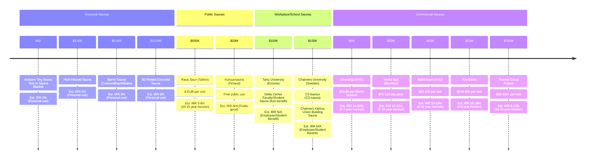

For a few glorious years, instead of paying the New York City tax of \$20 every time I set one foot out my door, I could have friends over and _sauna_ like the good Estonian I am. In my one bedroom apartment, unbeknownst to my landlord at the time, I managed to sneak in a disassembled sauna with a friend. It had cost \$500 on eBay, and the U-Haul moving truck cost \$100 to rent. 

Saunas are inaccessible; here's how to get one for your home, workplace, and city.

[saunalist.org has global sauna listings too!↗︎](https://saunalist.org)

<figure>
  
  <figcaption>Assembling a $500 sauna, in about thirty seconds.</figcaption>
</figure>

Saunas have financial returns and non-financial returns. They also cost variable amounts of money.

In the above video, you can see my friend Jeff and I assembling the first sauna I bought. It sat 3 people, lasted for several years, hundreds of friends used it; it cost \$500 off eBay. Jeff and I had a wake-up call during the pandemic where we realized we had spent thousands of dollars at the Russian Turkish Bathhouse in New York, which can cost upwards of \$50 per visit. We decided to buy a sauna instead.

The non-financial returns have been immense, which is why I decided to document a framework for visualizing and thinking about the "capital stacks", or the stack of capital investments that can be made in saunas, from personal saunas to public saunas to workplace saunas to commercial (for-profit) saunas.

The non-financial returns of saunas include:

- social connection risk score reduction (c.f. reviews on the public health risks of [loneliness](https://www.ncbi.nlm.nih.gov/pmc/articles/PMC5598785/))
- health benefits, such as reduced all-cause mortality (c.f. many articles such as [this one](https://www.ncbi.nlm.nih.gov/pmc/articles/PMC6262976/) describing research in cultures in which saunas are common, such as Finland)

Edit the following diagram [here](https://www.mermaidchart.com/app/projects/3eff3399-79fc-46e3-a424-3e78655e6142/diagrams/2168f791-4b5b-4eec-9f86-ca194dee46b7/version/v0.1/edit) if you have any suggestions, or Tweet/DM me on Twitter at [@thejaan](https://x.com/thejaan)!

